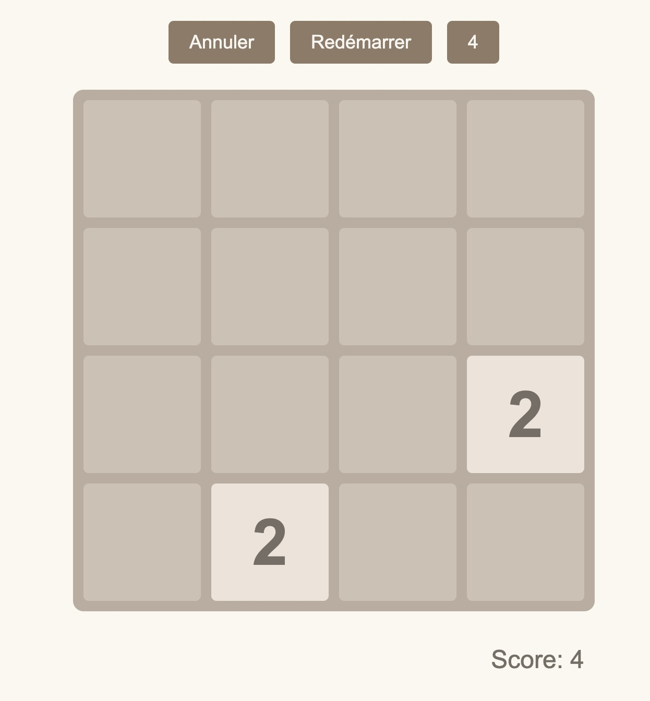
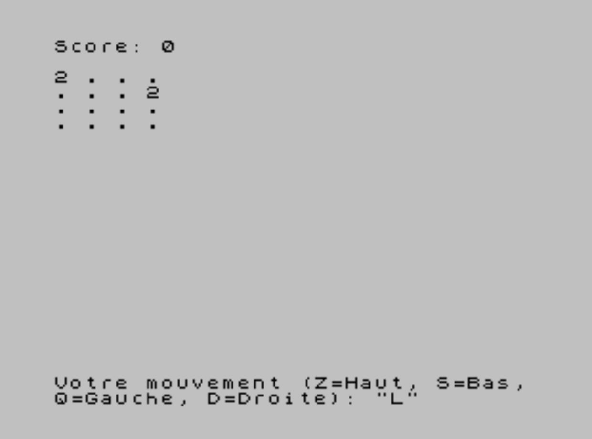

Une tentative de génération d'une webapp 2048 entièrement par chatGPT o1-preview. Pour le fun également généré pour le ZX spectrum 1982

* Version pour ZX spectrum [https://l0d0v1c.github.io/2048-chatGPT/spectrum/jsspeccy-3.1/](https://l0d0v1c.github.io/2048-chatGPT/spectrum/jsspeccy-3.1/)
* Version pour iOS/Javascript : [https://l0d0v1c.github.io/2048-chatGPT](https://l0d0v1c.github.io/2048-chatGPT/spectrum/jsspeccy-3.1/)

